# CUDA 2D 直接卷积的性能演进：从 Naive 到 Thread Blocked 优化实践

在算子开发中，卷积无论是在使用频率还是在使用耗时上都占有巨大角色，常见的img2col, implicite sgemm当然极具挑战性。直接卷积（Direct Convolution）可以作为CUDA学习的一个很好的实践，当然自己实现的核函数总是会有很多问题，更多的还是一次尝试。

本文主要记录并分析 CUDA 2D 直接卷积（Direct Convolution）从最原始的 Naive 实现，到逐步引入共享内存（Shared Memory）、线程粗化、向量化访存以及线程块阻塞（Thread Blocked）等加速技术，避免重复访问全局内存（Global Memory）以提升内存访问效率的完整演进过程。

以4K图像作为输入，3840 * 2160，输入通道1或3，输出通道1，卷积核尺寸为7 * 7，stride，padding默认为1和0.
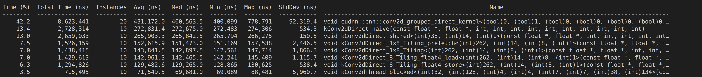 
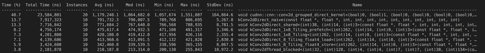
---

## 1. 核函数性能分析核心术语与理论模型

在进行内核调优前，需明确以下核心性能评测指标及硬件理论模型：

### 1.1 算力与访存指标
*   **计算访存比**：单位线程内：
$$\frac{\text{计算指令数}}{\text{访存指令数}}$$

*   **运算强度 (Arithmetic Intensity [FLOP/byte])**：单位内存交换量（Byte）下所完成的浮点运算次数（FLOPs）。
    $$\text{运算强度} = \frac{\text{Operations (FLOPs)}}{\text{Memory Traffic (Byte)}}$$

### 1.2 Roofline 模型
用于判断程序性能瓶颈的最高指导模型。
*   **纵轴 Performance [FLOPS]**：计算机硬件可达到的峰值性能（每秒处理的浮点运算次数，如 GFLOPS、TFLOPS）。*注意：FLOPS 是吞吐率单位，而 FLOPs 是衡量模型或 Kernel 大小的绝对工作量指标。*
*   **横轴 运算强度 [FLOP/byte]**：如上所述。

根据算子在 Roofline 模型中所处的位置，瓶颈可分为以下三类：
1.  **Memory-Bound（访存受限区）**：处于 Roofline 拐点左侧。GPU 算力尚未达到极限，但显存带宽已触顶。
    *   *典型场景*：简单的向量加法、数据搬运。
    *   *优化手段*：减少全局内存访问次数、使用共享内存、合并访存。
2.  **Compute-Bound（计算受限区）**：处于 Roofline 拐点右侧。显存搬运速度足够快，但 CUDA Core 的计算能力已达上限。
    *   *典型场景*：高阶矩阵乘、复杂的数学运算（如 `exp`）、大内核卷积。
    *   *优化手段*：优化算法逻辑、激活 Tensor Core。
3.  **Latency-Bound（延迟受限区）**：特征是距离 Roofline 边界线较远。由于内存访问延迟或指令执行延迟过高，导致硬件处于饥饿等待状态。

### 1.3 延迟与隐藏机制
*   **内存访问延迟**：
  
    | 存储类型     | 延迟(clock cycle) |
    |--------    |--------|
    | 寄存器      | ~1  |
    | 共享内存/L1 | 20~30  |
    | L2cache    | 100~200  |
    | 全局内存    | 400~800  |  
    *   *优化手段*：对齐访存并合并访存；避免 Bank Conflict 导致的串行访问；提高 Warp 占用率以覆盖访存延迟。
*   **指令执行延迟**：相邻指令间存在数据依赖，导致流水线阻塞。
    *   *优化手段*：数据预取。
*   **时延隐藏 (Latency Hiding)**：时延指 Warp 准备好执行下一条指令所需的时钟周期数。若所有 Warp 调度器在时延期间的每个时钟周期上都有可发射的指令，GPU 就能实现完全利用（时延被成功隐藏），系统利用率达到最大。
    *   隐藏长度为 $L$ 个时钟周期的时延所需的指令吞吐量取决于硬件架构。对于**计算能力 比较新的架构** 设备，该值为 $4L$。
    *   并行性：每一个 SM 有4个 warp scheduler，则SM 在一个时钟周期内为 4 个 Warp 各发出一条指令(128 thread 并行；)。
    *   并发性：通过warp scheduler 调度，每一个 SM 支持 1536/2048 个线程常驻。

### 1.4 占用率 (Occupancy)
$$\text{占用率} = \frac{\text{SM 中活跃的 Warp 数}}{\text{SM 理论最大 Warp 数}}$$
*   **作用**：更高的占用率通常能带来更好的性能，有助于隐藏内存访问延迟。每个 SM 最多可处理 $1536 / 32 = 48$ 个 Warp (or $2048 / 32 = 64$)。
*   **限制因素**：每个 Thread Block 中消耗的 Shared Memory 过多，或每个线程占用的寄存器（Register）过多。
    *   *调优建议*：可使用 nvcc 编译标志 `--maxregcount` 强制限制寄存器数量，或使用 `-Xptxas=-v` 获取具体的寄存器和共享内存使用情况。每个 Block 中的线程数量不宜过低（至少 128）。
*   **API 辅助**：可使用 `cudaOccupancyMaxPotentialBlockSize` 动态计算最佳 BlockSize，使 GPU 占用率达到理论最大化。

---

## 2. 核函数性能分析

### 2.1 kConv2dDirect_naive（原始朴素版本）
*   **设计亮点**：将可预计算的滤波权重值预先存储在常量内存（Constant Memory）中。进入内核后将其搬运至寄存器（Register），加快了局部读取速度。
*   **瓶颈分析**：
    *   **Roofline 表现**：处于拐点左侧，且距离边界较远。结合 NCU 分析，优化优先级应以解决 **Latency-Bound** 为主。
    *   **长延迟等待**：全局内存访问延迟大。NCU 中 **Long Scoreboard** 的 Stall Warp 占比高达 **58.74%**，说明 Warp 严重卡在等待长延迟操作上（运算强度几乎为 1）。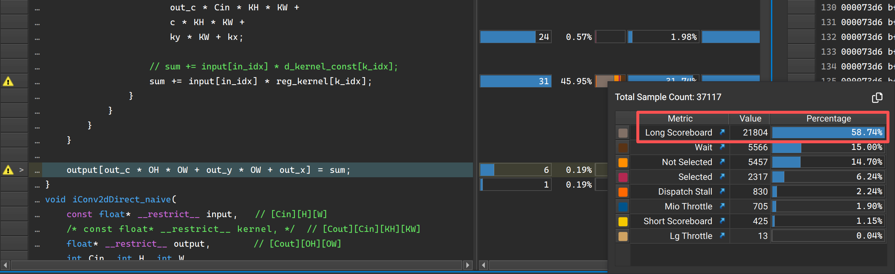
    *   **未对齐/非合并访存**：查看 NCU 的 `Memory Workload Analysis -> L1/TEX Cache -> Global Load / Global Store`。发生合并访存时，最小访存单位应等于 `Sectors/Req`。在本内核中，`Sectors/Req` 达到了 **5.71 和 5.79**，均大于 `float` 类型所需的最小单位 4 bytes。由于输出宽度不满足 32 字节对齐（`OW % 32 != 0`），导致访存未对齐，多消耗了带宽。NCU 的 Source 栏目也给出了 *"global accesses are excessive"* 的警告。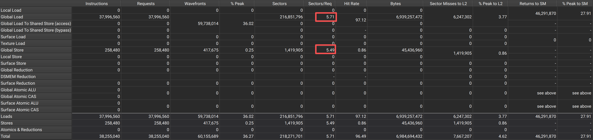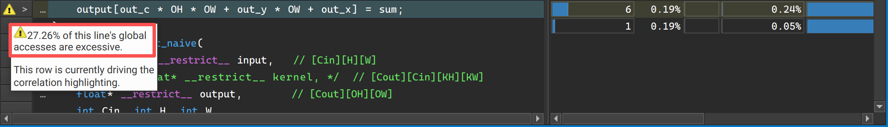
*   **潜在优化方向**：
    *   向量化（Vectorization）：减少指令数，提高计算访存比。
    *   双缓冲（Double Buffering）：提前加载全局内存，缩短 Long Scoreboard 导致的 Stall 时间。
    *   共享内存（Shared Memory）：Naive 版本对全局内存有严重的重复加载。搬运到 Shared Memory 中可大幅减少无效的延迟。
    *   *数据空间缩减理论*：
        $$\text{Naive 访存量} = H \times W \times C_{\text{out}} \times C_{\text{in}} \times KH \times KW$$

        Shared 访存量 = grid.x × grid.y × grid.z(Cout) × Cin × sharedSize × sharedSize
        
        在 $3840 \times 2160$ 分辨率下，两者存在 **GB 与 MB** 数量级的巨大差距（类似于 SGEMM 将访存从 $mn(k+k)$ 优化至 $MN(k \cdot b_m + k \cdot b_n) = \frac{m}{b_m} \frac{n}{b_n}(k \cdot b_m + k \cdot b_n)$）。
        
        *(注：为便于对比，均排除 L1/L2 缓存的影响。实际情况下 Global Load 会先穿透 L1/L2，全部 Miss 后才会读取 Device Memory。)*

---

### 2.2 kConv2dDirect_shared（共享内存版本）
*   **CUDA基本计算过程：**

    * 输入通道在最外层循环。
    * 搬运：将全局内存搬运到共享内存中，以共享内存的二维索引做循环，结合输出索引计算出对应输入的全局内存索引。
    * 计算：输入像素与卷积核做累加和，以卷积核的二维索引做循环，结合block内thread计算出对应的共享内存索引。
```CPP
    # pragma unroll
    for (int c = 0; c < Cin; c++) {
        // global to shared memory 
        # pragma unroll
        for (int y = ty; y < SHARED_SIZE_H; y += blockDim.y) {
            int in_y = in_start_y + y;
            # pragma unroll
            for (int x = tx; x < SHARED_SIZE_W; x += blockDim.x) {
                int in_x = in_start_x + x;

                s_input[y][x] = (in_x >= 0 && in_x < W && in_y >= 0 && in_y < H) ? 
                    input[c * H * W + in_y * W + in_x] : 0.0f; // 边界填充0
            }
        }
        __syncthreads();

        // compute
        # pragma unroll
        for (int ky = 0; ky < KH; ++ky) {
            int shared_y = ty * stride + ky;
            # pragma unroll
            for (int kx = 0; kx < KW; ++kx) {
                // shared memory 索引
                int shared_x = tx * stride + kx;
                if (shared_x >= SHARED_SIZE_W && shared_y >= SHARED_SIZE_H) return;

                int k_idx = out_c * Cin * KH * KW +
                            c * KH * KW +
                            ky * KW + kx;

                sum += s_input[shared_y][shared_x] * reg_kernel[k_idx];
            }
        }
        __syncthreads();
    }
```
*   **性能表现**：对比 Naive 版本，并未出现预想中的大幅跃升，性能提升**不到 5%**。
*   **NCU 指标诊断与反直觉现象分析**：
    *   **DRAM Throughput 升高**：这个指标变大有些反直觉，因为引入 Shared Memory 理论上应该减少从 DRAM 读取的字节总数。但细看定义会发现：该指标代表全周期内物理带宽达到峰值的平均百分比。虽然总数据量变小了，但由于运行时间（Time）也缩短了，就有可能导致在极短生命周期内**平均物理带宽利用率反而被拉高了**。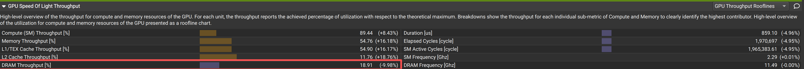
    *   **Device Memory Load 增大**：按理说该值应大幅减少。猜测是由于 L2 Cache 的某些换入换出机制导致，表现为 `L2 Cache Load Device Mem` 这一步出现了非预期放大（可进一步观察 Memory Chart 确认：Kernel 发出的 `LoadInst` 和 `Req` 确实如预期减少了）。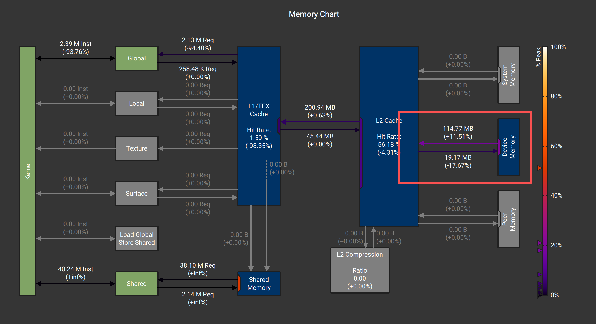
    *   **运算强度增加**：由于分子（FLOPs）不变，分母（DRAM Bytes）变小，Kernel 开始从 Roofline 左侧斜坡（访存受限）向右侧平顶区域（计算受限）移动。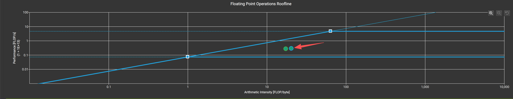
    *   **L1/TEX Hit Rate 大幅降低**：正常现象。数据搬入 Shared Memory 后，后续计算绕过了 L1/TEX 缓存。Shared Memory 在硬件上拥有单独的专用通道 **MIO Pipe**（与 Global Memory 具备并行的指令执行电路）。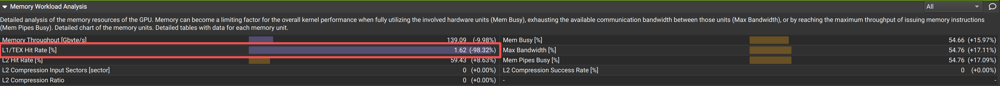
    *   **Stall Long Scoreboard 明显减少**：表明全局内存访问长延迟的问题得到了大幅缓解。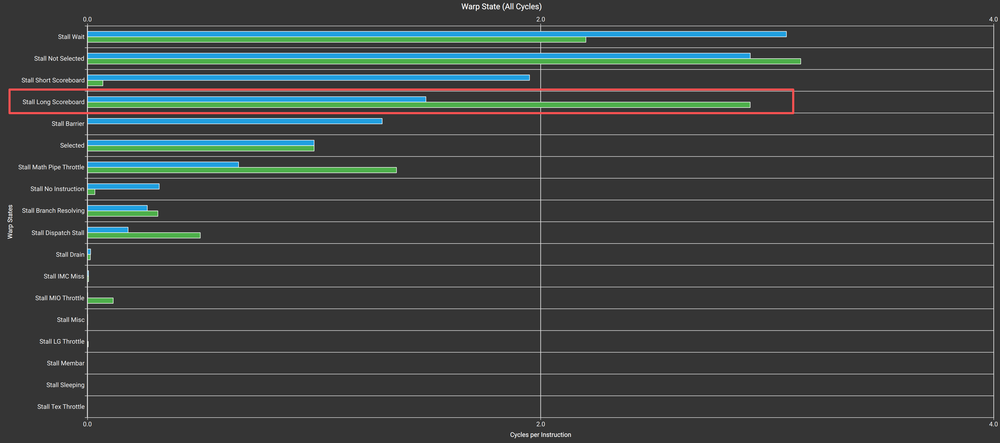
*   **新的致命瓶颈：Bank Conflict**  

    使用了 Shared Memory 但性能未暴涨，很自然指向了 Bank Conflict。
    
    NCU 证实：`shared load` 存在**两路冲突**，`shared store` 也有 1 点多的 conflict。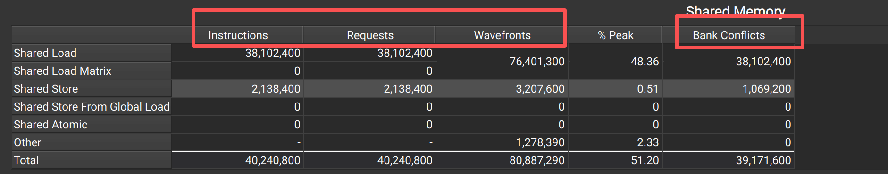
    * *Conflict分析*：当前线程块布局为 `block(16, 16)`。一个 Warp 包含 32 个线程：
        * 前 16 个线程（Thread 0~15）的 `ty = 0`，`tx = 0..15`，访问 Shared Memory 第 0 行。
        * 后 16 个线程（Thread 16~31）的 `ty = 1`，`tx = 0..15`，访问 Shared Memory 第 1 行。
        也就是说，单个 Warp 跨越了 Shared Memory 的两行。而二维共享内存声明为 `__shared__ float s_input[22][22]`（`SHARED_SIZE = 22`），属于行优先连续排布。
        当 Warp 内部线程同时执行 `s_input[shared_y][shared_x]`，假设此时滑窗迭代到 `ky=0, kx=0`：
        * Thread 0 (`ty=0, tx=0`) 访问：$0 × 22 + 0 = 0$ ->  **Bank 0**
        * Thread 26 (`ty=1, tx=10`) 访问：$1 × 22 + 10 = 32$ ->  **Bank 0**
  
        同一 Warp 中的 Thread 0 和 Thread 26 在同一时刻撞击了同一个 Bank 0。同理，Thread 1 和 Thread 27 撞在 Bank 1。导致访问被串行化。
    * *block(16, 16) Bank conflict计算*：
        * $Block 数：grid.x × grid.y × grid.z = ceil(3834/16) × ceil(2154/16) × 1 = 32400$
        * $Warp/Block 数：block.x × block.y / 32 = 8$
        * $总 Warp 数：32400 × 8 = 259200$
        * $每 Warp 内部执行 'shared load' 次数：C_in × KERNEL\_SIZE × KERNEL\_SIZE = 3 × 7 × 7 = 147$
        * 总的 `shared load` 指令请求数：259200 × 147 = 38102400。在存在 2 路冲突时，耗时指令周期直接翻倍。
    *   *解决方案*：将 Block 布局从 `block(16, 16)` 调整为 `block(32, 8)`，并对应修改 `TILE_SHARED`，迫使单个 Warp 紧凑排布在同一行内。
    ```CPP
    #define BLOCK_SIZE_X 32
    #define BLOCK_SIZE_Y 8
    #define TILE_SHARED_X (BLOCK_SIZE_X - 1) * STRIDE + KERNEL_SIZE 
    #define TILE_SHARED_Y (BLOCK_SIZE_Y - 1) * STRIDE + KERNEL_SIZE 
    ```
    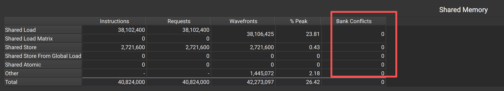

---

### 2.3 kConv2dDirect_1x8_Tiling（线程粗化版本）
```CPP
#define TILE_SHARED_NX (NTILING * BLOCK_SIZE_X - 1) * STRIDE + KERNEL_SIZE 
```
*   **优化原理**：通过线程粗化（Thread Coarsening）提高单个线程的计算复用率。减少了多余的地址计算指令（如 `IMAD`）、谓词设置指令（如 `ISETP`）以及内存访问延迟。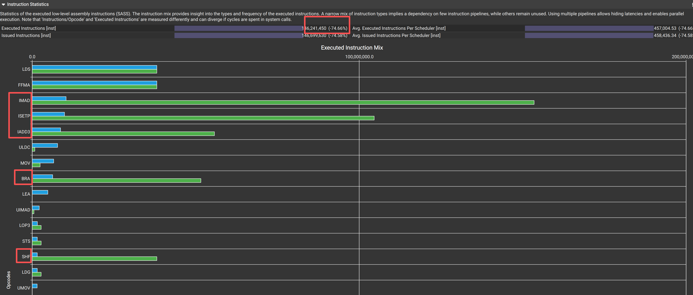
*   **权衡代价**：增大了单个 Block 的 Shared Memory 容量消耗，这会限制 Warp 调度器的弹性，降低占用率（Occupancy），从而削弱了隐藏内存延迟的能力。因此需要谨慎权衡占用率与 Shared Memory 大小（在实际开发中需对比 1x2、* **光晕（Halo）边沿压缩比优势**：二维直接卷积与 SGEMM 不同，在 Global $\rightarrow$ Shared 搬运时，必须额外多加载一圈由卷积核半径决定的 Halo 边界元素。随着 Tiling 尺寸扩大，这部分多余加载的浪费比例被有效稀释：
    * **基础 Shared 版本**：有效计算像素 $32 × 8 = 256$。Shared Memory 实际读取数为 $(32 + 6) × (8 + 6) = 532$。访存/计算比率：532 / 256 = 2.078。
    * **1x8 Tiling 版本**：有效计算像素 $(32 × 8) × 8 = 2048$。Shared Memory 实际读取数为 $(256 + 6) × (8 + 6) = 3668$。访存/计算比率：3668 / 2048 = 1.791（浪费明显下降）。

---

### 2.4 kConv2dDirect_1x8_Tiling_prefetch（双缓冲预取尝试）
*   **设计初衷**：旨在通过寄存器进行双缓冲（Double Buffering）数据预取，试图在每次循环迭代中隐式加载下一轮所需的数据，以此解决上一个版本由于 Shared Memory 过大导致占用率降低、无法隐藏内存延迟的问题。
*   **实际反馈**：实际测试中性能反而有所降低，后续需借助 NCU 进一步深入分析其编译器生成的汇编指令依赖（可能由于寄存器压力过大触发了 Spill 到 Local Memory 导致。（以上是幻觉推理，实际原因只能由ncu慢慢排查...））。

---

### 2.5 kConv2dDirect_8_Tiling_float4_load（向量化全局加载）
*   **优化手段**：对 Global $\rightarrow$ Shared 的加载阶段实施了 `float4` 向量化访存。
```CPP
    if (y_valid && in_x >= 0 && in_x + 3 < W) {
        v = reinterpret_cast<const float4*>(&input[c * H * W + in_y * W + in_x])[0];
    } 
    else {
        // 逐个元素读取，同时检查 y_valid 和 x 范围
        if (y_valid) {
            if (in_x + 0 >= 0 && in_x + 0 < W) v.x = input[c * H * W + in_y * W + in_x + 0];
            if (in_x + 1 >= 0 && in_x + 1 < W) v.y = input[c * H * W + in_y * W + in_x + 1];
            if (in_x + 2 >= 0 && in_x + 2 < W) v.z = input[c * H * W + in_y * W + in_x + 2];
            if (in_x + 3 >= 0 && in_x + 3 < W) v.w = input[c * H * W + in_y * W + in_x + 3];
        }
    }

    // 边界，避免写入s_input[y][131]的情况
    if (x + 0 < SHARED_SIZE_W) s_input[y][x + 0] = v.x;
    if (x + 1 < SHARED_SIZE_W) s_input[y][x + 1] = v.y;
    if (x + 2 < SHARED_SIZE_W) s_input[y][x + 2] = v.z;
    if (x + 3 < SHARED_SIZE_W) s_input[y][x + 3] = v.w;
```
*   **局限性**：性能提升相对有限。因为在输出端写回时，由于 `out_x` 之间存在 `blockDim.x` 的大步长间隔，导致 Global Store 阶段无法打包为连续的 `float4`。
*   **硬件机制反思**：对于 Load（加载）而言，由于 GPU 内部具备强大的 L1/L2 Cache 及预取合并机制，即使软件层未显式编写 `float4`，硬件也能在一定程度上自发优化合并。而 Store（写回）不具备这种容错缓存缓冲机制。
> *“Using vectorized loads reduces the total number of instructions, reduces latency, and improves bandwidth utilization.”* —— NVIDIA Developer Blog

---

### 2.6 kConv2dDirect_8_Tiling_float4_store（向量化全局写回）
*   **优化手段**：保持 Global Load 不变，但在 Global Store 阶段进行了 `float4` 优化。
```CPP
    if (is_aligned && (out_x_base + 7 < OW)) {
        float4* out_ptr = reinterpret_cast<float4*>(&output[base]);
        out_ptr[0] = make_float4(sum0, sum1, sum2, sum3);
        out_ptr[1] = make_float4(sum4, sum5, sum6, sum7);
    }
    else {
        if (out_x_base + 0 < OW) output[base + 0] = sum0;
        if (out_x_base + 1 < OW) output[base + 1] = sum1;
        if (out_x_base + 2 < OW) output[base + 2] = sum2;
        if (out_x_base + 3 < OW) output[base + 3] = sum3;
        if (out_x_base + 4 < OW) output[base + 4] = sum4;
        if (out_x_base + 5 < OW) output[base + 5] = sum5;
        if (out_x_base + 6 < OW) output[base + 6] = sum6;
        if (out_x_base + 7 < OW) output[base + 7] = sum7;
    }
```
*   **成效对比**：相较于仅做 Load 向量化的版本，该版本获得了明显的性能提升。
*   **数据排布重构**：为了满足 `float4` 对内存连续性的硬性要求，修改了每个线程负责的输出像素排列方式。将之前间隔 `blockDim.x` 的跳跃排布，改成了**水平方向连续的 8 个像素**。写回时，每 4 个连续像素直接通过一条 128-bit 指令，减少了写回端的延迟。

---

### 2.7 kConv2dThread_blocked（线程块）
*   **设计核心**：该版本基本模仿了 **SGEMM 中的 Thread Tile** 设计方案。
*   **机制跃升**：继续深化线程粗化思想，提高寄存器利用率。它规避了之前版本盲目扩大单次 Shared Memory 尺寸导致 Occupancy 骤降的瓶颈。通过在寄存器中维护一个二维计算小矩阵，使取出的各段输入像素在寄存器内部与 $T_M \times T_N$ 个不同的参数反复进行乘加（FMA）运算。
*   **性能终审**：该举措极大地拉高了算子的运算强度，而运算强度与性能强相关。观察 Roofline 模型可以发现，核函数已经成功顺着斜率右移，跃升到了更高的位置。尽管当前依然处于 Memory-Bound 状态，但纯软件计算效率已逼近极限，后续需对接更加底层的硬件调优。

---

## 3. 性能演进总结与瓶颈比对

| 优化版本形态 | 核心运用的优化技术 | NCU 带来的定量表现改善 | 剩余的主要核心瓶颈 |
| :--- | :--- | :--- | :--- |
| `naive` | Constant Memory 缓存权重 | 建立了基础的低延迟权重读取 | Long Scoreboard 严重阻塞 (58.74%)，非合并访存严重 |
| `shared` | 引入片上 Shared Memory，调整 Block 为 `32x8` | 全局访存需求量暴跌，成功清除了 Bank Conflict | 线程计算指令利用率低，边沿 Halo 浪费占比较大 |
| `1x8_Tiling` | 水平像素线程粗化复用 | 整体指令执行数大幅减少，Halo 加载比例下降 | 大容量 Shared Memory 压低了 Warp 占用率 |
| `float4_store` | 线程负责像素重构为连续，强刷 `float4` 写回 | 大幅提升显存物理写入带宽，Store 延迟归零 | 软件纯模拟外积的计算效率达到传统 CUDA 核心天花板 |
| `thread_blocked` | 寄存器二维平铺，全面看齐 SGEMM 计算流 | 运算强度剧增，在 Roofline 模型中显著右移 | 受限于传统显存物理带宽，需进一步做访存精细对齐 |

---

## 4. Ref

1. David B. Kirk, Wen-mei W. Hwu. 《CUDA C 权威编程指南》.
2. NVIDIA 技术社区. *CUDA 矩阵乘法及卷积算子调优实践深度剖析*.
3. Tongkaio. *SGEMM & Conv2d Optimization Kernel Samples*, GitHub.
4. van Werkhoven, B. *An Analysis of Vectorization and Thread Tiling in GPU Kernels*, 2011.
