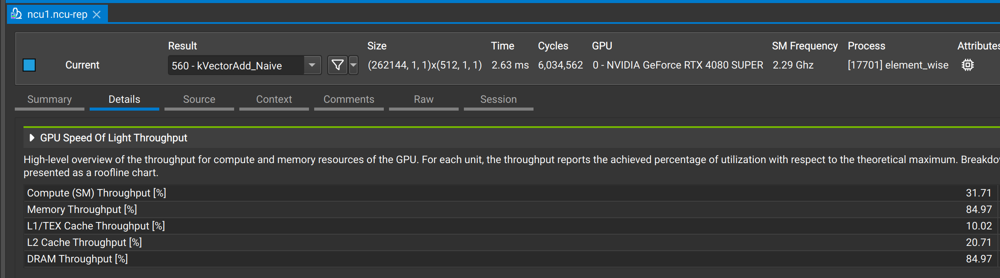
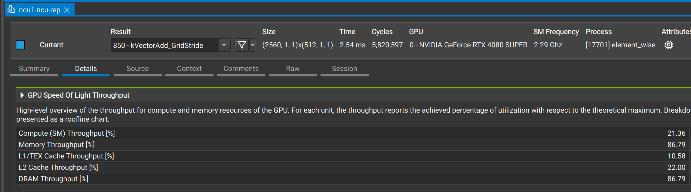
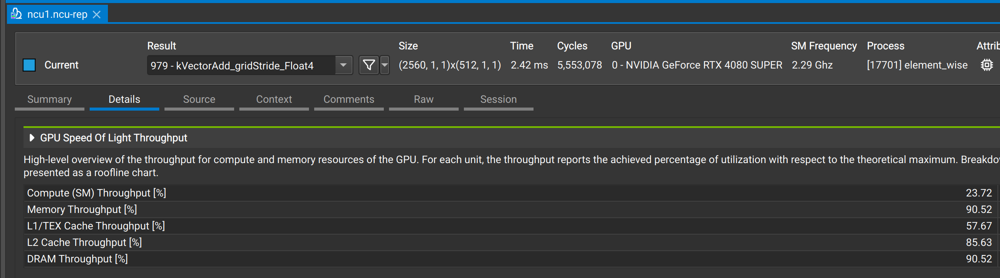
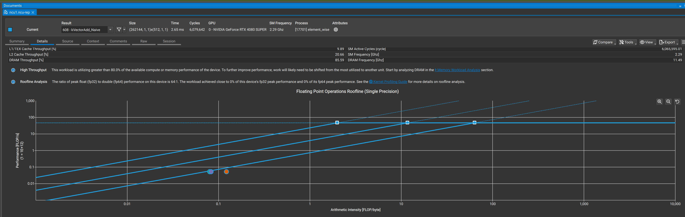

# CUDA Element-wise Vector Add Optimization (Roofline-Based Analysis)

## CUDA背景

本CUDA以 element-wise（向量加法）为例，学习在Roofline Model 理论框架下，逐步逼近内存带宽上限（memory bandwidth roof） 的优化过程。

所有优化版本均基于同一算法：
> C[i] = A[i] + B[i]

优化目标不是“增加算力利用率”，而是：

**在 memory-bound 前提下，最大化 DRAM 带宽利用率**

## Roofline Model 理论基础

根据 Roofline Model，kernel 的性能上限由以下两者中较小者决定：

**𝑃 = min(𝑃𝑝𝑒𝑎𝑘, 𝐵𝑊𝑝𝑒𝑎𝑘×𝑂𝐼)**

其中：
 
𝑃𝑝𝑒𝑎𝑘：GPU 理论峰值算力（FLOP/s）

𝐵𝑊𝑝𝑒𝑎𝑘：GPU 峰值内存带宽（Byte/s）

𝑂𝐼：Operational Intensity（FLOP / Byte）


### Element-wise Kernel 的运算强度（OI）

以单精度向量加法为例：C[i] = A[i] + B[i];

FLOPs：1 次加法

内存访问：

load A → 4 Bytes

load B → 4 Bytes

store C → 4 Bytes

共 12 Bytes

或者说： 计算密度 = 计算量 / 访存量

𝑂𝐼=1/12≈0.083FLOP/Byte

### 理论上：

在现代 GPU 上：𝑂𝐼𝑟𝑖𝑑𝑔𝑒=𝑃𝑝𝑒𝑎𝑘𝐵𝑊𝑝𝑒𝑎𝑘≈10∼20

而本 kernel 的 OI：
0.083 ≪ 𝑂𝐼𝑟𝑖𝑑𝑔𝑒

所以compute永远不是瓶颈，所有有效优化只能围绕memory。

## 各 Kernel 版本的优化解释

### Naive Kernel（Baseline）

```c
__global__ void kVectorAdd_Naive(...)
{
    C[i] = A[i] + B[i];
}
```

特征：
1. 每线程处理 1 个元素
2. scalar load/store
3. 内存访问完全顺序

Roofline：OI极低性能由 DRAM 带宽决定

ncu可以看到： Compute (SM) Throughput 很低, Memory Throughput 和 DRAM Throughput 很高。落在Roofline compute-bound即斜线上。
实际性能通常低于带宽 Roofline（未充分利用）

### Float4 向量化（Vectorized Memory Access）


```c
reinterpret_cast<const float4*>(A)
```

#### 优化动机（根据Roofline论文）：

> 使用更宽的内存访问粒度，可以减少指令数量，提高有效带宽利用率。

#### 关键点：

float4 不会改变OI: FLOPs 和 Bytes 同比例增加。


|		| float   | float4 |
|-------| ------- | -------|
|FLOPs  |  1      |    4   |
|Bytes	|12		  | 48     |
|OI		|1/12     |  1/12  |


#### 本质：

减少 load/store 指令数量，提高 memory transaction 合并度，让实际带宽更接近理论峰值。

**注意：不是提高 Roofline 上限，而是更接近带宽 Roofline**

### Grid-Stride Loop（提高并行度）


```
for (int i = g_id; i < N; i += stride)
```

#### 设计目标：

保证 GPU 所有 SM 都被充分填满，暴露足够并行度以隐藏 DRAM latency。

#### Grid 配置策略：


```
gridSize = 32 * numSMs;
```


这是一个经验值，用于：

1. 保证每个 SM 有足够 block

2. 提供足够 in-flight warp

Roofline：若并行度不足，即使是 memory-bound kernel，也无法达到带宽 Roofline。

### Grid-Stride + Float4（理论最优版本）


```
kVectorAdd_gridStride_Float4
```

该版本同时具备：

1. 最小访存字节数

2. 向量化 load/store

3. 充分的线程并行度

4. 顺序、合并的内存访问模式

Roofline 结论：

在不改变算法的前提下，该实现已逼近 memory bandwidth roof。

进一步的算术优化或指令优化 不会带来数量级性能提升。

### 是否需要使用数据perfetching优化

按照论文中所指出的优化方式，还有一个虽然收益不大但仍有必要做的技巧。

实际上：prefetch应用在 latency-bound

从ncu metric中也可以发现：


以naive kernel为例，最里层的斜线表示DRAM的 memory roof，而kernel 正好落在这个斜线附近，也证明了它属于 bound-memory。

所以，没有必要再做prefetch优化。

只有点在斜线下方很远
才可能是 latency / occupancy / launch 问题。

**prefetch 的目标不是带宽，而是延迟**

## 性能上限与优化边界

根据 Roofline Model：**𝑃𝑚𝑎𝑥=𝐵𝑊𝑝𝑒𝑎𝑘 × 𝑂𝐼**

对于 element-wise kernel：

OI 固定且极低，性能上限完全由内存系统决定。

这意味着：

1. 增加 FLOPs 无意义

2. 使用 Tensor Core 无意义

3. 进一步 unroll 收益极小

## 结论

#### Element-wise kernel 天生是 memory-bound

1. float4 优化的本质是提高带宽利用率，而非提高算力

2. Grid-stride loop 的作用是填满 GPU，而非加速单线程

3. Grid-stride + vectorization 是该问题的理论最优解

4. 即使使用了多种优化技巧，核函数仍处于memory-bound中

## 分析工具

### Nsight Compute metric验证：

dram__throughput.avg.pct_of_peak_sustained_elapsed 或者 Memory Throughput 和 DRAM Throughpu
sm__throughput.avg.pct_of_peak_sustained_elapsed 或者 Compute (SM) Throughput

#### 典型 memory-bound 特征：

DRAM 带宽接近峰值

SM 利用率显著偏低

## 参考

Williams et al., Roofline: An Insightful Visual Performance Model for Floating-Point Programs and Multicore Architectures


